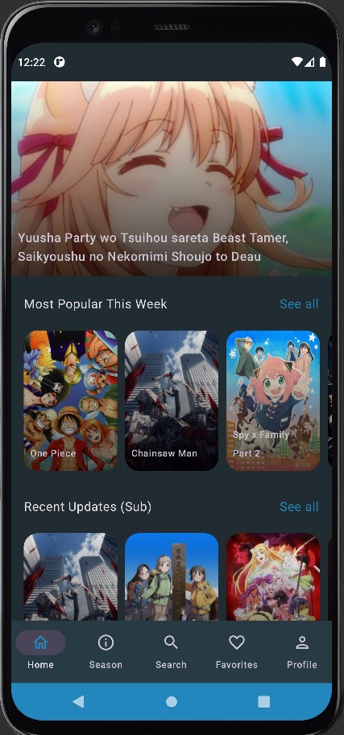
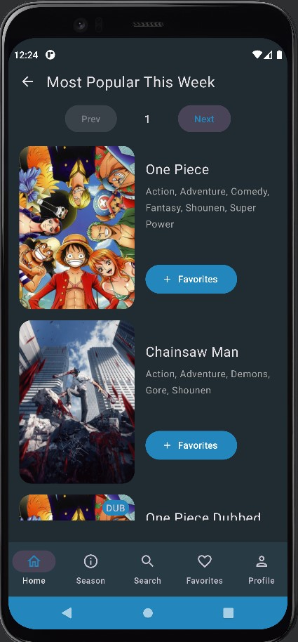
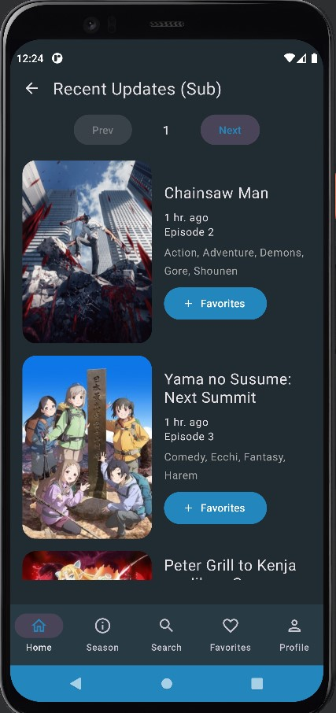
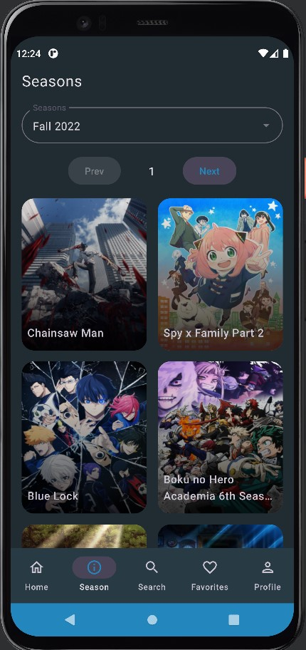
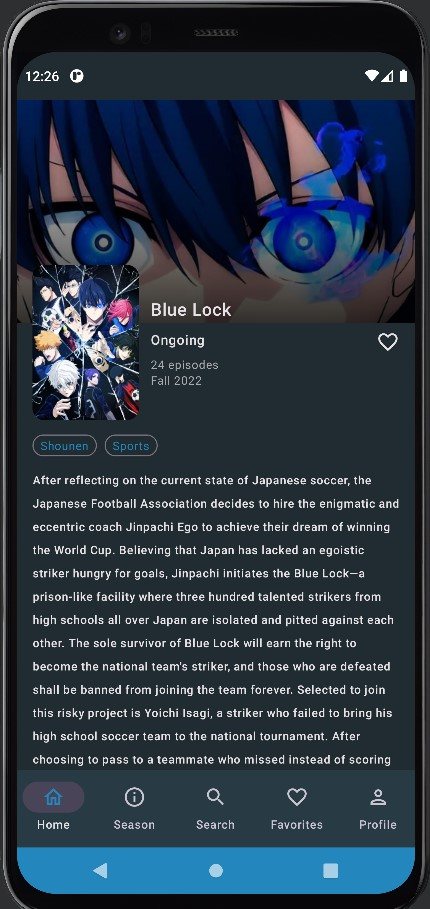

# AnKunv2
AnKunv2 is an app a bit similar to YouTube but to stream anime.

Updated from [AnKun](https://github.com/RadXGH/AnKun) using Jetpack Compose.

# Tech Stack
- Kotlin
- AndroidX
- UI - [Jetpack Compose](https://developer.android.com/jetpack/compose)
- HTML parser - [Jsoup](https://jsoup.org/)
- Image from URL loader - [Coil](https://coil-kt.github.io/coil/compose/)
- Image slider - [Google Accompanist - HorizontalPager](https://google.github.io/accompanist/)

# App Preview

# Developers
Albert E (vradnisntlong@gmail.com)
